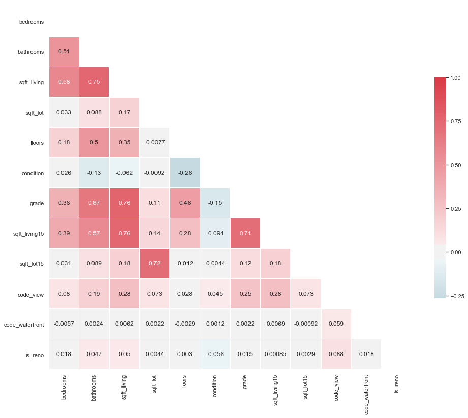

# The Stock Market
## Using News Headlines to Better Predict the Stock Market

**Author**: Lauren Esser

The contents of this repository detail an analysis of the module one project. This analysis is detailed in hopes of making the work accessible and replicable.


### Business problem:
Can we use News Headlines to better predict when the S&P 500 will rise? 
>By creating a model that gives a high success rate of stock market predictions we can invest our money wisely to make good profits. 

### Data
**Stock Market Data:** www.kibot.com/free_historical_data.aspx
Stock Market data comes from kibot.com which provides free historical intraday data on the S&P500 dating back to September 2009. To obtain data click [here](www.kibot.com/free_historical_data.aspx), scroll down to the bottom of the page, and download "Tick with bid/ask data" under IVE(S&P 500 Value Index). You will want to upload the file into your Google drive in order to follow along with the notebook.

**News Headline Data:** https://www.kaggle.com/rmisra/news-category-dataset
The news dataset contains around 200k news headlines from 2012 to 2018 obtained from the Huffington Post.To obtain data click [here](https://www.kaggle.com/rmisra/news-category-dataset) then click the download button in the top right. Once again you will want to upload the file into your Google drive in order to follow along with the notebook.


## Methods
The OSEMN Process was used within this project, I will go over each step briefly below:

**Obtain**: Data was obtained on Huffington Post news headlines and stocks from the S&P 500. Please see the above Data Section for more details.

**Scrub**:
*STOCKS*: To scrub the stocks dataset I first checked for nulls and the information column. I then converted the date column to datetime and set date as the index. In order to make sure I was looking at the same time frame for both stocks and news articles, I sliced and saved the correct dates for stocks to correspond to the news articles 01-28-2012 to 05-26-2018. As a last step I resampled the stocks data to business day frequency.

*NEWS*: The first step I took in scrubbing news was to identify a start date and end date within my data in order to see the specific timeline of news headlines. I then set index to date in order to match the stocks dataframe. Next, it was time to clean and prepare my words for modeling. In order to do this I tokenized, removed stop words, lemmatized, and stemmed my headlines to ensure the headlines would go smoothly into the model. 


**Explore**:
*Stocks*: During the exploration process of stocks I took time to look at many different visuals in order to understand the S&P 500 more. Some of these visuals include: line plot, dot plot, rolling statistics plot, the dickey-fuller test, histogram, density plot, log transformation, and differencing. Seen below is the rolling statistics plot:


*NEWS*: Within the news section I wanted to get a feel for the different categories of news headlines we have as well as the most common words used through out the news dataset. 

1. Headline Count of Each Genre


2. Word Cloud of most commonly used words


3. Bar Graph of Word Count


**Model**:
There are three main sections of modeling used within this notebook. I will cover each of these models below:

1. *Stocks Time Series Models*
To create the Stocks Time Series Model I created three different types of models an ARMA Model, Neural Network, and SARIMA Model. Below is the information and visuals on my SARIMA Model.

- SARIMA MODEL:

- STATESPACE MODEL RESULTS

- DIAGNOSTICS

- FORECAST OF S&P 500


2. *NLP Model*
In order to set up for the NLP model specific steps had to take place before building the model. First I calculated the change in stocks between each day and set this as a target column titled 'daily_change'. I then I identified if this change was positive or negative. If positive it would show as a 1 in a new column called 'movement', if negative it would show as a 0.

Code for daily differences:
```
stocks_ts['daily_change'] = stocks_ts.diff(periods=1)
stocks_ts.head()
```

Second, I joined together news headlines by day using groupby and aggregate.

Code for groupby:
```
b = news.groupby(news.index)
b.head(3)
```
Code for aggregate:
```
news2 = b.agg({'headline': ' '.join})
news2.head()
```

Third, I offset the news headline using the shift method to move all of the headline rows up one in order to correspond with the date before. By doing this I can use the headlines from the day before in order to see if the stock market is increasing or decreasing. Within this section I also resampled my news headlines to business days in order to correspond with the stock market data.

Code for shift:
```
news2 = news2.shift(periods = -1)
news2.head(10)
```

Code for business days:
```
news2 = news2.resample('B').last()
news2.head(10)
```

Fourth, I merged tables using pandas SQL.
Code example:
```
q = '''SELECT s.date, s.movement,  n.headline, s.Price, s.daily_change
                FROM stocks_ts s
                JOIN news2 n
                ON n.date = s.date;'''
df = pysqldf(q)
df.head()
```

Firth I performed a train, test, split. Since date is important in this model I could not perform the train, test, split the usual way. 

Train, Test, Split to keep date in order:
```
#Set X and y
X = df['headline']
y = df.movement

#train_test_split
int_split = round(len(X)*.8) 
X_train = X.iloc[:int_split]
X_test = X.iloc[int_split:]

y_train = y.iloc[:int_split]
y_test = y.iloc[int_split:]
```
Lastly, I tokenized and padded news headline for preparation of creating our model.

Example code:
```
tokenizer = Tokenizer(num_words = max_words)
tokenizer.fit_on_texts(X_train) 
sequences = tokenizer.texts_to_sequences(X_train)
X_train_padded = tf.keras.preprocessing.sequence.pad_sequences(
    sequences, maxlen = max_sequence_length)
print(X_train_padded)
```

Creation of the NLP Model: For the NLP Model I created an LSTM Neural Network as well as a Random Forest. Both models came out with the same accuracy, therefore I will cover the LSTM Model here.

Model:


Model Visuals:


3. *Using results from NLP to create a new Time Series Model*
**Interpret**:

## Results

### Here are examples of how to embed images from your sub-folder


#### Visual 1


> Sentence about visualization.

#### Visual 2


> Sentence about visualization.


## Recommendations:

More of your own text here


## Limitations & Next Steps

More of your own text here


### For further information
Please review the narrative of our analysis in [our jupyter notebook](./index.ipynb) or review our [presentation](./SampleProjectSlides.pdf)

For any additional questions, please contact **email, email, email)


##### Repository Structure:

Here is where you would describe the structure of your repoistory and its contents, for exampe:

```

├── README.md               <- The top-level README for reviewers of this project.
├── index.ipynb             <- narrative documentation of analysis in jupyter notebook
├── presentation.pdf        <- pdf version of project presentation
└── images
    └── images               <- both sourced externally and generated from code
└── data
    └── 

```
